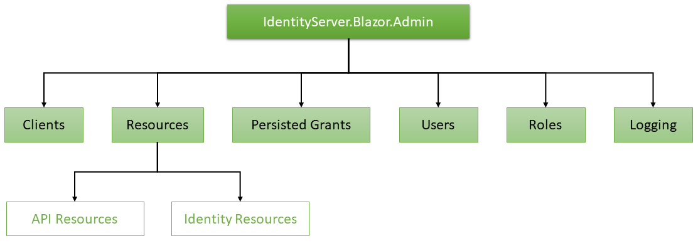

# IdentityServer.BlazorAdmin

> Administration UI for IdentityServer4 and Asp.Net Core Identity using WebAssembly with Blazor

## Project status

This project is currently in **development**

The application is written using **Blazor on Asp.Net Core - .NET Core 3.0**

**NOTE:** Works only with **IdentityServer4 version => 2.3.0**

**NOTE:** Blazor is an unsupported, experimental web framework that shouldn't be used for production workloads at this time.

## Requirements

- [Install](https://dotnet.microsoft.com/download/dotnet-core/3.0) the latest .NET Core 3.x SDK. This version is still in a preview version and shouldn't be used for production workloads at this time.

- [Install](https://docs.microsoft.com/pt-br/aspnet/core/client-side/spa/blazor/get-started?view=aspnetcore-3.0&tabs=netcore-cli&viewFallbackFrom=aspnetcore-2.2#tabpanel_CeZOj-G++Q_netcore-cli) and follow the instructions to install the Blazor Templates for .NET CLI

- [Install](https://go.microsoft.com/fwlink/?linkid=870389) If you are using Visual Studio 2017 / 2019, install the Blazor Language Services extension to enable Blazor Templates and Support on Visual Studio

## Solution Structure

- **STS**:

  - **IdentityServer.AspNetIdentity.Shared** - Shared classes like DTO objetcs, shared between Identity Server and Blazor Views for Login, Password Reset and other stuff

  - **IdentityServer.AspNetIdentity.Blazor.Client** - Blazor Components used in place of Razor views like Login on Identity Server

  - **IdentityServer.AspNetIdentity.Server** - Identity Server 4 with ASP.NET Core Identity and EF Storage. Also, servers Blazor views for Login and other common views for IS4

- **Admin**

  - **IdentityServer.Blazor.Admin.Shared** - Shared classes like DTO objetcs, shared between Identity Server and Blazor Views for Users, Claims, Resources and other CRUD stuff for IS administration

  - **IdentityServer.Blazor.Admin.Client** - Blazor Components used for Identity Server administration, like Users, Resources, Claims CRUD views

  - **IdentityServer.Blazor.Admin.Server** - ASP.NET Core application hosting the Admin API and also serving Blazor Components from Admin.Client project

- **Tests**

    `TBD`

## The Admin application contains the following modules:

